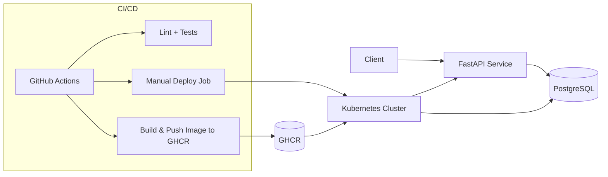

# Server Management API

[](https://github.com/krasnoshchok/server-management-api/actions/workflows/ci-cd.yml)

FastAPI + PostgreSQL service designed as a DevOps portfolio project: containerized, tested, Kubernetes-ready, Terraform-managed, and CI/CD automated.

## Why This Project

This repository demonstrates practical DevOps engineering skills, not just API coding:

- Async Python service with real database interactions.
- Reproducible Docker image with multi-stage build and non-root runtime.
- Kubernetes deployment with probes, resource limits, secrets, and persistent storage.
- Terraform-based infrastructure definition for cluster resources.
- CI pipeline with lint + smoke + PostgreSQL integration test.
- Manual-gated deployment workflow to control costs and risk.

## Tech Stack

- Backend: FastAPI, asyncpg, Pydantic
- Database: PostgreSQL
- Containerization: Docker, Docker Compose
- Orchestration: Kubernetes (Minikube-friendly manifests)
- IaC: Terraform (Kubernetes provider)
- CI/CD: GitHub Actions + GHCR

## Architecture



## Resume Signal

If you include this on your resume, these are the strongest talking points:

- Implemented secure secret flow from GitHub Secrets to Kubernetes Secret references.
- Hardened workloads with startup/readiness/liveness probes and resource governance.
- Added PVC-backed Postgres storage instead of ephemeral pod volume.
- Built quality gates in CI with real integration tests against PostgreSQL.
- Switched deployment to manual trigger to avoid unintended cloud spend.

## Quick Start

### Option A: Docker Compose (fastest local demo)

1. Set environment values:

```bash
cp .env.example .env
# edit DB_PASSWORD in .env
```

2. Start services:

```bash
docker-compose -f docker/docker-compose.yml up --build
```

3. Initialize database schema:

```bash
docker exec -i $(docker-compose -f docker/docker-compose.yml ps -q db) \
  psql -U postgres -d server_management < sql/schema.sql
```

4. Open API docs:

- Swagger: http://localhost:8000/docs
- ReDoc: http://localhost:8000/redoc

### Option B: Local Python + local Postgres

```bash
uv venv
source .venv/bin/activate
uv pip install --python .venv/bin/python --requirement requirements.lock
createdb server_management
psql server_management < sql/schema.sql
uvicorn app.main:app --reload
```

### Option C: Kubernetes manifests (Minikube)

1. Build image in Minikube:

```bash
minikube image build -f docker/Dockerfile -t server-management-api:latest .
```

2. Create DB secret:

```bash
kubectl create secret generic server-management-db \
  --from-literal=DB_NAME=server_management \
  --from-literal=DB_USER=postgres \
  --from-literal=DB_PASSWORD=change_me \
  --from-literal=POSTGRES_DB=server_management \
  --from-literal=POSTGRES_USER=postgres \
  --from-literal=POSTGRES_PASSWORD=change_me
```

3. Apply manifests:

```bash
kubectl apply -f k8s/
```

4. Initialize schema:

```bash
kubectl exec -i deploy/postgres -- \
  psql -U postgres -d server_management < sql/schema.sql
```

5. Access service:

```bash
kubectl port-forward svc/server-api 8000:8000
```

## Kubernetes Hardening Included

Current manifests include:

- Startup/readiness/liveness probes for API and Postgres.
- CPU/memory requests and limits.
- Secret-based credentials (no plaintext passwords in manifests).
- Restricted container privileges (`allowPrivilegeEscalation: false`, dropped caps).
- `RuntimeDefault` seccomp profile.
- Postgres persistence using PVC (`postgres-data`).

## Terraform Path

Terraform under `terraform/` provisions Kubernetes objects equivalent to the manifests.

```bash
cd terraform
terraform init
terraform plan -var="db_password=change_me" -out=tfplan
terraform apply tfplan
```

## CI/CD Workflow

Workflow file: `.github/workflows/ci-cd.yml`

- On push/PR to `main`: run lint + tests.
- Deploy job: manual trigger only (`workflow_dispatch`).
- Image publish: GHCR.
- Cluster access: `KUBECONFIG_BASE64` secret.

Required GitHub Secrets:

- `KUBECONFIG_BASE64`
- `DB_NAME`
- `DB_USER`
- `DB_PASSWORD`

## API Surface

- `GET /health`
- `GET /servers/`
- `GET /servers/{server_id}`
- `POST /servers/`
- `PUT /servers/{server_id}`
- `DELETE /servers/{server_id}`

Example create request:

```bash
curl -X POST "http://localhost:8000/servers/" \
  -H "Content-Type: application/json" \
  -d '{
    "hostname": "webserver.local.lan",
    "configuration": {"cpu_cores": 8, "ram_gb": 32},
    "datacenter_id": 1
  }'
```

## Repository Layout

```text
app/                 FastAPI app and routers
k8s/                 Kubernetes manifests
docker/              Dockerfile and compose config
terraform/           Terraform configuration
sql/                 Schema and seed data
.github/workflows/   CI/CD pipeline
```

## Development Notes

- Logging is configurable via environment variables.
- Integration tests run when `RUN_INTEGRATION_TESTS=1`.
- Dependency install is managed via `uv` and `requirements.lock`.
- Local test command:

```bash
uv run --python .venv/bin/python pytest -q
```

## Next Improvements

- Add coverage threshold enforcement in CI.
- Add NetworkPolicy manifests for namespace-level traffic control.
- Add OpenTelemetry/Prometheus instrumentation for runtime observability.
